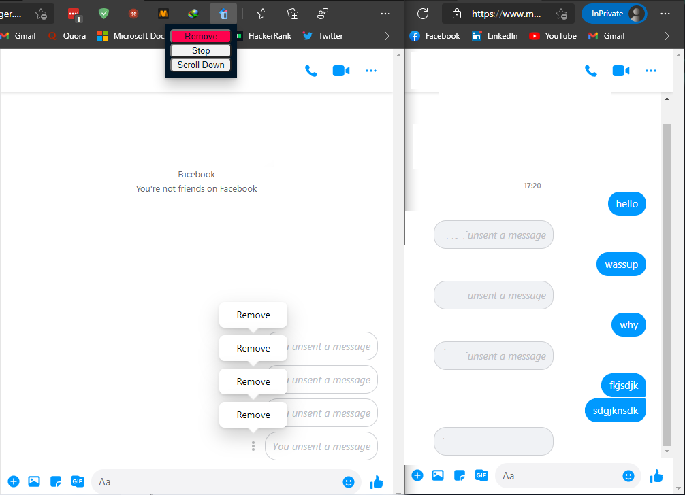

# EraseConvo
A simple Chrome / Edge Chromium extension to unsend all conversations.


EraseConvo is a Chrome extension that automatically unsends every message you have in a messenger chain. Unlike other extensions, which only hide the messages from the user's inbox, EraseConvo will remove messages from the RECEIVER'S inbox as well. 

Open a messenger thread, hit 'Remove', and go get a coffee. While you're gone, the extension will click on every 'unsend message' button, leaving behind a trail of nothing.
### This is how it works

  
  
After using EraseConvo, you WILL NOT be able to access your messages anymore.


### Installation

- Download [here](https://github.com/evilprince2009/EraseConvo/releases/tag/1.0.0).
- Go to ```chrome://extensions``` or ```edge://extensions``` in your browser.
- Drop the ```.crx``` file right here and you're done!

### If above method doesn't work !  click on "Load unpacked extension..." and select the folder where you downloaded EraseConvo.zip. 

- Download the Source Code [here](https://github.com/evilprince2009/EraseConvo/releases/tag/1.0.0).
- Extract the ```EraseConvo-1.0.0.zip``` file.
- Go to ```chrome://extensions``` or ```edge://extensions``` in your browser and hit "Load unpacked extension...".
- Select the uncompressed ```EraseConvo-1.0.0``` folder and you are good to go!